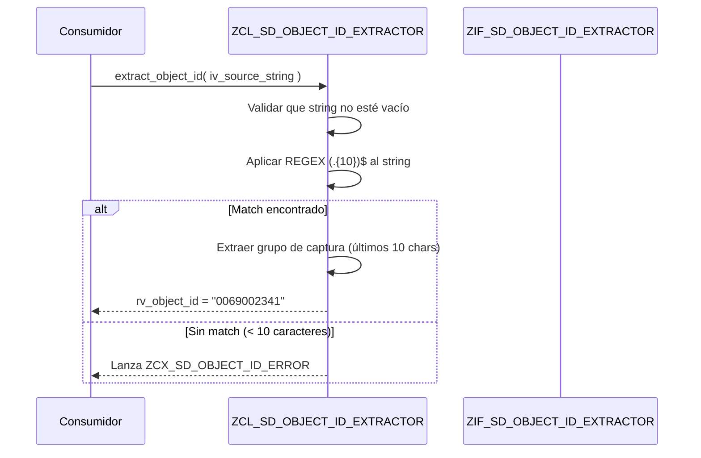

# Documento de Diseño: Object ID Extractor

## Descripción General

Función utilitaria ABAP que extrae el Object ID (últimos 10 caracteres) de un string de longitud variable. El prefijo del string varía según el contexto, pero el Object ID siempre ocupa las últimas 10 posiciones.

Ejemplo: `"R3AD_SALESDO0069002341"` → Object ID: `"0069002341"`

## Algoritmo Principal / Flujo de Trabajo



## Interfaces y Tipos

```abap
*----------------------------------------------------------------------*
* Interfaz: ZIF_SD_OBJECT_ID_EXTRACTOR
* Descripción: Contrato para extracción de Object ID desde strings
* Paquete: ZDEV_COMMON
*----------------------------------------------------------------------*
INTERFACE zif_sd_object_id_extractor PUBLIC.

  CONSTANTS gc_object_id_length TYPE i VALUE 10.
  CONSTANTS gc_regex_pattern    TYPE string VALUE '(.{10})$'.

  "! Extrae el Object ID (últimos 10 caracteres) de un string fuente
  "! usando expresión regular (.{10})$.
  "! @parameter iv_source_string | String completo que contiene el Object ID
  "! @parameter rv_object_id     | Object ID extraído (10 caracteres)
  "! @raising zcx_sd_object_id_error | Si el string es vacío o no hace match con el patrón
  METHODS extract_object_id
    IMPORTING iv_source_string TYPE string
    RETURNING VALUE(rv_object_id) TYPE char10
    RAISING   zcx_sd_object_id_error.

ENDINTERFACE.
```

```abap
*----------------------------------------------------------------------*
* Clase de excepción: ZCX_SD_OBJECT_ID_ERROR
* Descripción: Excepción para errores de extracción de Object ID
* Paquete: ZDEV_COMMON
*----------------------------------------------------------------------*
CLASS zcx_sd_object_id_error DEFINITION
  PUBLIC
  INHERITING FROM cx_static_check
  CREATE PUBLIC.

  PUBLIC SECTION.
    INTERFACES if_t100_message.

    CONSTANTS:
      BEGIN OF gc_empty_string,
        msgid TYPE symsgid VALUE 'ZSD_OBJID',
        msgno TYPE symsgno VALUE '001',
        attr1 TYPE scx_attrname VALUE '',
        attr2 TYPE scx_attrname VALUE '',
        attr3 TYPE scx_attrname VALUE '',
        attr4 TYPE scx_attrname VALUE '',
      END OF gc_empty_string,
      BEGIN OF gc_no_match,
        msgid TYPE symsgid VALUE 'ZSD_OBJID',
        msgno TYPE symsgno VALUE '002',
        attr1 TYPE scx_attrname VALUE 'MV_LENGTH',
        attr2 TYPE scx_attrname VALUE '',
        attr3 TYPE scx_attrname VALUE '',
        attr4 TYPE scx_attrname VALUE '',
      END OF gc_no_match.

    DATA mv_length TYPE i READ-ONLY.

    METHODS constructor
      IMPORTING
        textid   LIKE if_t100_message=>t100key OPTIONAL
        previous TYPE REF TO cx_root OPTIONAL
        iv_length TYPE i OPTIONAL.

ENDCLASS.
```

## Funciones Clave con Especificaciones Formales

### Función: extract_object_id()

```abap
"! Extrae el Object ID (últimos 10 caracteres) de un string fuente
"! usando expresión regular (.{10})$.
METHODS extract_object_id
  IMPORTING iv_source_string TYPE string
  RETURNING VALUE(rv_object_id) TYPE char10
  RAISING   zcx_sd_object_id_error.
```

**Precondiciones:**
- `iv_source_string` no es vacío (`strlen( iv_source_string ) > 0`)
- `strlen( iv_source_string ) >= 10` (implícito: el patrón REGEX requiere al menos 10 caracteres)

**Postcondiciones:**
- `rv_object_id` contiene exactamente 10 caracteres
- `rv_object_id` corresponde al grupo de captura `(.{10})$` del string de entrada
- El string de entrada no se modifica (sin efectos secundarios)

**Invariantes de bucle:** N/A (operación REGEX sin bucle explícito)

## Pseudocódigo Algorítmico

### Algoritmo de Extracción con REGEX

```abap
METHOD extract_object_id.
  " Paso 1: Validar que el string no esté vacío
  IF iv_source_string IS INITIAL.
    RAISE EXCEPTION TYPE zcx_sd_object_id_error
      EXPORTING textid = zcx_sd_object_id_error=>gc_empty_string.
  ENDIF.

  " Paso 2: Crear REGEX y Matcher con patrón (.{10})$
  DATA(lo_regex) = NEW cl_abap_regex(
    pattern = zif_sd_object_id_extractor=>gc_regex_pattern ).

  DATA(lo_matcher) = lo_regex->create_matcher(
    text = iv_source_string ).

  " Paso 3: Intentar match
  IF lo_matcher->match( ) = abap_false.
    RAISE EXCEPTION TYPE zcx_sd_object_id_error
      EXPORTING
        textid    = zcx_sd_object_id_error=>gc_no_match
        iv_length = strlen( iv_source_string ).
  ENDIF.

  " Paso 4: Extraer grupo de captura 1 (últimos 10 caracteres)
  rv_object_id = lo_matcher->get_submatch( index = 1 ).
ENDMETHOD.
```

**Precondiciones:**
- El parámetro iv_source_string es proporcionado (puede ser vacío)
- La constante gc_regex_pattern = '(.{10})$' está definida en la interfaz
- CL_ABAP_REGEX y CL_ABAP_MATCHER están disponibles en el sistema

**Postcondiciones:**
- Si el string es vacío → lanza ZCX_SD_OBJECT_ID_ERROR (gc_empty_string)
- Si el REGEX no hace match (strlen < 10) → lanza ZCX_SD_OBJECT_ID_ERROR (gc_no_match)
- Si match exitoso → retorna el grupo de captura 1 (últimos 10 caracteres exactos)
- Sin efectos secundarios sobre el parámetro de entrada

**Invariantes de bucle:** N/A

## Implementación de la Clase

```abap
*----------------------------------------------------------------------*
* Clase: ZCL_SD_OBJECT_ID_EXTRACTOR
* Descripción: Implementación concreta de ZIF_SD_OBJECT_ID_EXTRACTOR.
*              Extrae Object ID (últimos 10 caracteres) de un string
*              usando REGEX con CL_ABAP_REGEX / CL_ABAP_MATCHER.
*              Sin dependencias externas. Lógica pura.
* Paquete: ZDEV_COMMON
*----------------------------------------------------------------------*
CLASS zcl_sd_object_id_extractor DEFINITION
  PUBLIC FINAL
  CREATE PUBLIC.

  PUBLIC SECTION.
    INTERFACES zif_sd_object_id_extractor.

ENDCLASS.

CLASS zcl_sd_object_id_extractor IMPLEMENTATION.

  METHOD zif_sd_object_id_extractor~extract_object_id.
    IF iv_source_string IS INITIAL.
      RAISE EXCEPTION TYPE zcx_sd_object_id_error
        EXPORTING textid = zcx_sd_object_id_error=>gc_empty_string.
    ENDIF.

    DATA(lo_regex) = NEW cl_abap_regex(
      pattern = zif_sd_object_id_extractor=>gc_regex_pattern ).

    DATA(lo_matcher) = lo_regex->create_matcher(
      text = iv_source_string ).

    IF lo_matcher->match( ) = abap_false.
      RAISE EXCEPTION TYPE zcx_sd_object_id_error
        EXPORTING
          textid    = zcx_sd_object_id_error=>gc_no_match
          iv_length = strlen( iv_source_string ).
    ENDIF.

    rv_object_id = lo_matcher->get_submatch( index = 1 ).
  ENDMETHOD.

ENDCLASS.
```

## Ejemplo de Uso

```abap
" Ejemplo 1: Uso básico — extracción exitosa
DATA(lo_extractor) = NEW zcl_sd_object_id_extractor( ).

TRY.
    DATA(lv_object_id) = lo_extractor->zif_sd_object_id_extractor~extract_object_id(
      iv_source_string = 'R3AD_SALESDO0069002341' ).
    " lv_object_id = '0069002341'
  CATCH zcx_sd_object_id_error INTO DATA(lx_error).
    " Manejo de error
ENDTRY.

" Ejemplo 2: String exacto de 10 caracteres
TRY.
    DATA(lv_id_exact) = lo_extractor->zif_sd_object_id_extractor~extract_object_id(
      iv_source_string = '0069002341' ).
    " lv_id_exact = '0069002341'
  CATCH zcx_sd_object_id_error INTO DATA(lx_err2).
ENDTRY.

" Ejemplo 3: String demasiado corto — lanza excepción
TRY.
    lo_extractor->zif_sd_object_id_extractor~extract_object_id(
      iv_source_string = 'SHORT' ).
  CATCH zcx_sd_object_id_error INTO DATA(lx_err3).
    " lx_err3 contiene mensaje: string demasiado corto (longitud = 5)
ENDTRY.

" Ejemplo 4: Inyección de dependencias en otra clase
CLASS zcl_sd_some_service DEFINITION PUBLIC FINAL CREATE PUBLIC.
  PUBLIC SECTION.
    METHODS constructor
      IMPORTING io_extractor TYPE REF TO zif_sd_object_id_extractor OPTIONAL.
  PRIVATE SECTION.
    DATA mo_extractor TYPE REF TO zif_sd_object_id_extractor.
ENDCLASS.

CLASS zcl_sd_some_service IMPLEMENTATION.
  METHOD constructor.
    mo_extractor = COND #(
      WHEN io_extractor IS BOUND THEN io_extractor
      ELSE NEW zcl_sd_object_id_extractor( ) ).
  ENDMETHOD.
ENDCLASS.
```

## Propiedades de Correctitud

```abap
" Propiedad 1: Para todo string S con strlen(S) >= 10,
"   extract_object_id(S) hace match con REGEX (.{10})$
"   y retorna el grupo de captura 1.
" → El resultado siempre son los últimos 10 caracteres extraídos por REGEX.

" Propiedad 2: Para todo string S con strlen(S) >= 10,
"   strlen( extract_object_id(S) ) = 10
" → El resultado siempre tiene exactamente 10 caracteres.

" Propiedad 3: Para todo string S con strlen(S) < 10 y S no vacío,
"   extract_object_id(S) lanza ZCX_SD_OBJECT_ID_ERROR (gc_no_match)
" → Strings cortos no hacen match con (.{10})$ y producen excepción.

" Propiedad 4: Para string vacío S = '',
"   extract_object_id(S) lanza ZCX_SD_OBJECT_ID_ERROR (gc_empty_string)
" → String vacío siempre produce excepción específica antes del REGEX.

" Propiedad 5: Para todo string S con strlen(S) >= 10,
"   extract_object_id( prefix && object_id ) = object_id
"   donde strlen(object_id) = 10
" → La concatenación de cualquier prefijo con un ID de 10 chars siempre retorna el ID.

" Propiedad 6: Idempotencia parcial — Para todo object_id con strlen = 10,
"   extract_object_id( object_id ) = object_id
" → Si el input ya es un Object ID de 10 chars, se retorna sin cambios.

" Propiedad 7: Consistencia REGEX — El patrón (.{10})$ es equivalente a
"   substring( S, strlen(S) - 10, 10 ) para todo S con strlen >= 10.
" → El enfoque REGEX produce el mismo resultado que el offset directo.
```
